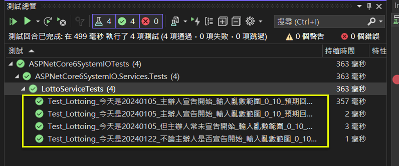

## 靜態元素 (Static Elements) 的單元測試, 以 System.IO.File.ReadAllText 為例
Unit Test for Static Elements (System.IO.File.ReadAllText) in ASP.NET Core 6 MVC   

## 前言

接續前一篇 <a href="https://www.jasperstudy.com/2024/01/static-elements-datetimenow.html" target="_blank">樂透開獎(含日期限制)</a> 的例子, 假設有一個新的需求:   "樂透開奬有一個前置作業, 必須由主辦人員按下[開始]按鈕, 才能開獎".  

本文假設按下[開始]按鈕, 會在主機端產生一個檔案 (start.txt), 內含主辦人員的姓名.  

因此, 程式要增加一個讀取檔案內容的動作.  
* 若可讀到 start.txt, 才可開獎, 並回傳開獎的結果, 要再加上主辦人員的姓名.  
* 若讀不到 start.txt, 則不可開獎, 並回傳警告訊息.  
  * "", -2, "主辦人員尚未按下[開始]按鈕".   // 第1個空字串, 代表主辦人員的姓名

這裡很單純的想法, 是用 File.ReadAllText() 的方法, 因為是 static class + static method 要如何建立測試呢?  

以下係採 參考文件1..及2.. 方式進行演練及實作.  

完整範例可由 GitHub 下載.

<!--more-->

## 演練細節

### 步驟_1: 安裝以下套件
* TestableIO.System.IO.Abstractions.Wrappers 20.0.4: 
  * 用以將 System.IO 的類別, 以 interface 的方式進行打包. 以 System.IO.File 為例, 會有 IFile 介面及 FileWrapper 類別.  
* TestableIO.System.IO.Abstractions.TestingHelpers 20.0.4
  * 主要有一些現成的 mock 類別, 以利測試之用.  

### 步驟_2: 將 IFileSystem 註冊至 DI container
```csharp
#region 註冊相關的服務
builder.Services.AddSingleton<IRandomGenerator, RandomGenerator>();
builder.Services.AddScoped<ILottoService, LottoService>();
builder.Services.AddSingleton<IDateTimeProvider, DateTimeProvider>();
builder.Services.AddSingleton<IFileSystem, FileSystem>();
#endregion
```

### 步驟_3: 修改 LottoService 的處理邏輯

1.. 修改建構子, 加入 IFileSystem 物件的注入.  
```csharp
private readonly IRandomGenerator _randomGenerator;
private readonly IDateTimeProvider _dateTimeProvider;
private readonly IFileSystem _fileSystem;

public LottoService(IRandomGenerator randomGenerator, IDateTimeProvider dateTimeProvider, IFileSystem fileSystem) 
{
	_randomGenerator = randomGenerator;
	_dateTimeProvider = dateTimeProvider;
	_fileSystem = fileSystem;
}
```

2.. 修改 Lottoing() 方法, 加入 Extra/startup.txt 的檢查.  
```csharp
public LottoViewModel Lottoing(int min, int max)
{

    var result = new LottoViewModel();

    // -----------------------
    // 檢核1: 是否為每個月 5 日
    // -----------------------
    var now = _dateTimeProvider.GetCurrentTime();
    if (now.Day != 5)
    {
        result.Sponsor = string.Empty;
        result.YourNumber = -1;
        result.Message = "非每個月5日, 不開獎";
        return result;
    }

    // -----------------------
    // 檢核2: 主辦人員是否已按下[開始]按鈕
    // -----------------------
    // 註: 這裡有可能會出現一些 Exception, 例如: FileNotFoundException
    var sponsor = string.Empty;
    try
    {
        sponsor = _fileSystem.File.ReadAllText("Extras/startup.txt");
    }
    catch (Exception)
    {
        result.Sponsor = sponsor;
        result.YourNumber = -2;
        result.Message = "主辦人員尚未按下[開始]按鈕";
        return result;
    }

    // Random(min, max): 含下界, 不含上界
    var yourNumber = _randomGenerator.Next(min, max);
    // 只要餘數是 9, 就代表中獎
    var message = (yourNumber % 10 == 9) ? "恭喜中獎" : "再接再厲";
    result.Sponsor = sponsor;
    result.YourNumber = yourNumber;
    result.Message = message;

    return result;
}
```

### 步驟_4: 修改原有的測試案例

1.. 因為 LottoService 的建構子增加了 IFileSystem 這個參數, 所以, 原有的測試案例, 也要跟著改, 不然會編譯失敗.  

```csharp
[TestMethod()]
public void Test_Lottoing_今天是20240105_主辦人宣告開始_輸入亂數範圍_0_10_預期回傳_9_恭喜中獎()
{
	// Arrange
	var expected = new LottoViewModel()
	{ Sponsor = "傑士伯", YourNumber = 9, Message = "恭喜中獎" }
				.ToExpectedObject();

	int fixedValue = 9;
	DateTime today = new(2024, 01, 05);
	var mockRandomGenerator = new Mock<IRandomGenerator>();
	var mockDateTimeProvider = new Mock<IDateTimeProvider>();
	mockRandomGenerator.Setup(r => r.Next(It.IsAny<int>(), It.IsAny<int>())).Returns(fixedValue);
	mockDateTimeProvider.Setup(d => d.GetCurrentTime()).Returns(today);
	//
	var mockFileSystem = new MockFileSystem(new Dictionary<string, MockFileData>
		{
			{ @"Extras/startup.txt", new MockFileData("傑士伯") },
		}
	);


	// Act
	var target = new LottoService(mockRandomGenerator.Object, mockDateTimeProvider.Object, mockFileSystem);
	var actual = target.Lottoing(0, 10);

	// Assert
	expected.ShouldEqual(actual);
}


[TestMethod()]
public void Test_Lottoing_今天是20240105_主辦人宣告開始_輸入亂數範圍_0_10_預期回傳_1_再接再厲()
{
	// Arrange
	var expected = new LottoViewModel()
	{ Sponsor="傑士伯", YourNumber = 1, Message = "再接再厲" }
				.ToExpectedObject();

	int fixedValue = 1;
	DateTime today = new(2024, 01, 05);
	var mockRandomGenerator = new Mock<IRandomGenerator>();
	var mockDateTimeProvider = new Mock<IDateTimeProvider>();
	mockRandomGenerator.Setup(r => r.Next(It.IsAny<int>(), It.IsAny<int>())).Returns(fixedValue);
	mockDateTimeProvider.Setup(d => d.GetCurrentTime()).Returns(today);
	var mockFileSystem = new MockFileSystem(new Dictionary<string, MockFileData>
		{
			{ @"Extras/startup.txt", new MockFileData("傑士伯") },
		}
	);

	// Act
	var target = new LottoService(mockRandomGenerator.Object, mockDateTimeProvider.Object, mockFileSystem);
	var actual = target.Lottoing(0, 10);

	// Assert
	expected.ShouldEqual(actual);
}


[TestMethod()]
public void Test_Lottoing_今天是20240122_不論主辦人是否宣告開始_輸入亂數範圍_0_10_預期回傳_負1_非每個月5日_不開獎()
{
	// Arrange
	var expected = new LottoViewModel()
	{ Sponsor = "", YourNumber = -1, Message = "非每個月5日, 不開獎" }
				.ToExpectedObject();

	int fixedValue = 9;
	DateTime today = new(2024, 01, 22);
	var mockRandomGenerator = new Mock<IRandomGenerator>();
	var mockDateTimeProvider = new Mock<IDateTimeProvider>();
	mockRandomGenerator.Setup(r => r.Next(It.IsAny<int>(), It.IsAny<int>())).Returns(fixedValue);
	mockDateTimeProvider.Setup(d => d.GetCurrentTime()).Returns(today);
	var mockFileSystem = new MockFileSystem(new Dictionary<string, MockFileData>
		{
			{ @"Extras/startup.txt", new MockFileData("傑士伯") },
		}
	);

	// Act
	var target = new LottoService(mockRandomGenerator.Object, mockDateTimeProvider.Object, mockFileSystem);
	var actual = target.Lottoing(0, 10);

	// Assert
	expected.ShouldEqual(actual);
}
```

### 步驟_5: 針對有開獎的日期, 但主辦人尚未宣告開始, 建立測試案例

```csharp
[TestMethod()]
public void Test_Lottoing_今天是20240105_但主辦人常未宣告開始_輸入亂數範圍_0_10_預期回傳_負2_主辦人員尚未按下開始按鈕()
{
    // Arrange
    var expected = new LottoViewModel()
    { Sponsor = "", YourNumber = -2, Message = "主辦人員尚未按下[開始]按鈕" }
                .ToExpectedObject();

    int fixedValue = 1;
    DateTime today = new(2024, 01, 05);
    var mockRandomGenerator = new Mock<IRandomGenerator>();
    var mockDateTimeProvider = new Mock<IDateTimeProvider>();
    mockRandomGenerator.Setup(r => r.Next(It.IsAny<int>(), It.IsAny<int>())).Returns(fixedValue);
    mockDateTimeProvider.Setup(d => d.GetCurrentTime()).Returns(today);
    var mockFileSystem = new MockFileSystem(new Dictionary<string, MockFileData>
        {
            //只要不提供檔案路徑, 就會視為 FileNotFound Exception
            //{ @"startup.txt", new MockFileData("傑士伯") },
        }
    );

    // Act
    var target = new LottoService(mockRandomGenerator.Object, mockDateTimeProvider.Object, mockFileSystem);
    var actual = target.Lottoing(0, 10);

    // Assert
    expected.ShouldEqual(actual);
}
```

### 步驟_6: 檢查測試的結果



## 結論


## 參考文件

* <a href="https://www.nuget.org/packages/System.IO.Abstractions" target="_blank">1.. (Nuget) System.IO.Abstractions</a>  
* <a href="https://github.com/TestableIO/System.IO.Abstractions" target="_blank">2.. 上述 nuget 套件的原始程式碼</a>  
* <a href="https://learn.microsoft.com/en-us/dotnet/api/system.io.file?view=net-6.0" target="_blank">3.. (Microsoft Learn) File Class</a>  
> public static class File
* <a href="https://learn.microsoft.com/en-us/dotnet/api/system.io.file.readalltext?view=net-6.0" target="_blank">4.. (Microsoft Learn) File.ReadAllText Method</a>  
> public static string ReadAllText (string path);
* <a href="https://www.ruyut.com/2023/05/testableio.system-io-abstractions.html" target="_blank">5.. (Ruyut 鹿遊) C# 使用 System.IO.Abstractions 套件來模擬檔案</a>


